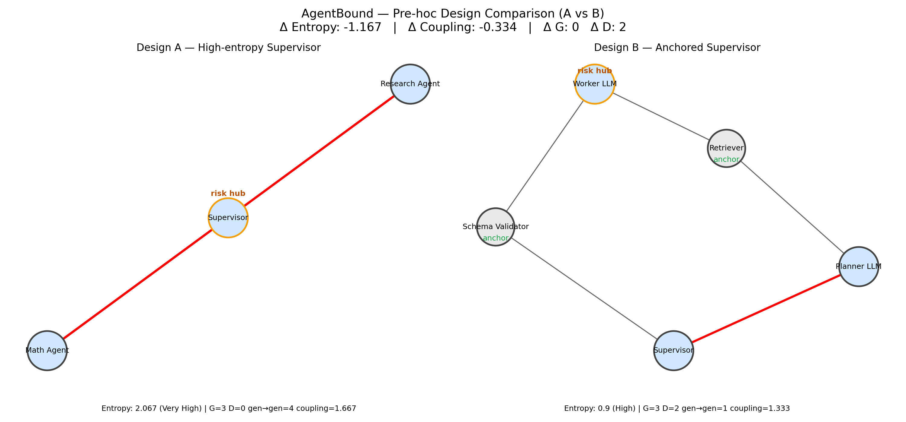

# AgentBound

AgentBound is a design-time static analysis tool for AI agent systems. Think of it like a linter for agent graphs: it computes an _agentic entropy_ score from an agent architecture and flags risky patterns such as long generative-to-generative chains, loops, and missing validators.

By running AgentBound on your system design, you can:

* Identify structural risks before finalizing code.
* Compare design variants to see how changes affect stability.
* Export diagrams and metrics for design reviews.

> **Skeptical? Need empirical validation?**
>
> The [`validation/`](validation/) directory contains experiments showing that AgentBound’s entropy scores track real brittleness in lightweight simulation tests.  
> See [`VALIDATION.md`](validation/VALIDATION.md) for full details.

## Demos

Run one of the included demos to see AgentBound in action:

- [Customer Support Workflow demo](./examples/customer_support_agent/HOW_TO_RUN.md) - shows how small design changes (adding a Doc Filter or Validator) shift entropy.
- [Dummy LangGraph Supervisor demo](./examples/dummy_langgraph_supervisor/HOW_TO_RUN.md) - shows how the LangGraph Supervisor pattern changes entropy under different designs.

## Learn it

Learn more about [agentic entropy](#what-is-agentic-entropy), [how AgentBound scores a graph](#how-agentbound-scores-a-graph), and [what AgentBound does and doesn't claim](#what-agentbound-does-and-does-not-claim).

## Use it

1. Complete the [general setup](#general-setup).
2. Use AgentBound to [analyze a single graph](#analyze-a-single-graph) or [compare two graphs](#compare-two-graphs).
3. [Interpret the output](#interpret-agentbound-output).

## Table of Contents

* [Demos](#demos)
* [Learn it](#learn-it)
  * [What is agentic entropy?](#what-is-agentic-entropy)
  * [What AgentBound does and does not claim](#what-agentbound-does-and-does-not-claim)
  * [How AgentBound scores a graph](#how-agentbound-scores-a-graph)
* [Use it](#use-it)
  * [Quickstart: Run the Demo](#quickstart-run-the-demo)
  * [General setup](#general-setup)
  * [Analyze a single graph](#analyze-a-single-graph)
  * [Compare two graphs](#compare-two-graphs)
  * [Interpret AgentBound output](#interpret-agentbound-output)
    * [Single graph analysis](#single-graph-analysis)
    * [Comparison](#comparison)
    * [Next steps based on output](#next-steps-based-on-output)
* [Validation](#validation)
* [Project status](#project-status)
* [Getting help](#getting-help)
* [License](#license)

## What is agentic entropy?

*Agentic entropy* is a structural signal that reflects the **potential unpredictability** of an agentic system before it is deployed. High entropy often indicates higher design risk, such as:

* Unpredictable hand-offs between generative components
* Missing validators or control points
* Loops or long generative chains

> Agentic entropy is an area of **active research**. The scoring methodology will continue to be refined.

## What AgentBound does and does not claim

* **Design-time signal only.** Based on graph structure and heuristics. Helps you catch risky shapes before final implementation.
* **Useful for architecture reviews.** Justify adding validators, reducing LLM-to-LLM chains, or splitting flows.
* **NOT a runtime guarantee.** Doesn’t predict accuracy or KPIs. Complements—rather than replaces—post-deploy evals and monitoring.

## How AgentBound scores a graph

AgentBound extracts the following from the graph (excluding aux nodes):

* **G** = count of generative nodes
* **D** = count of deterministic nodes
* **gg** = count of edges from generative → generative

**Node kind inference (can be overridden with a kind map):**

* Generative if id/label matches `llm|gpt|model|generate|writer|assistant|agent|supervisor` (case-insensitive)
* Deterministic otherwise
* Aux if id starts with `__` (excluded from scoring)

**Coupling factor:**

```python
coupling = 1.0 + (sqrt(gg) / max(1, G))   if G > 0
coupling = 1.0                            if G == 0
```

**Entropy score (V0):**

```python
entropy = (G / max(1, G + D)) * coupling + 0.1 * gg
```

**Risk levels:**

* `< 0.30` → Low
* `< 0.60` → Moderate
* `< 0.90` → High
* `≥ 0.90` → Very High

**Optional resilience (if results JSON is provided):**

* Requires `baseline.fail_rate` and `perturbed.fail_rate`
* Resilience index:

  ```python
  if both fail rates ~0 → 1.0
  else → 1 - (perturbed / max(eps, baseline)), bounded [0,1]
  ```
* Quadrant classification:

  * Low entropy + Low resilience → Fragile
  * High entropy + Low resilience → Chaotic Fragility
  * Low entropy + High resilience → Robust
  * High entropy + High resilience → Antifragile

**Outputs:**

* PNG diagram with generative→generative edges highlighted in red
* JSON report with entropy metrics, and optional resilience/quadrant

## Quickstart: Run the Demo

Two demos are included:

1. [Customer Support Workflow](./examples/customer_support_agent/HOW_TO_RUN.md)  
   Three variants of a customer support pipeline. See how risky LLM-to-LLM edges raise entropy and how Doc Filters/Validators change outcomes.

2. [Dummy LangGraph Supervisor](./examples/dummy_langgraph_supervisor/HOW_TO_RUN.md)  
   Two variants of LangGraph’s Supervisor pattern. Compare how additional deterministic anchors shift entropy from Very High → Moderate.

## General setup

1. Clone the repository:

   ```bash
   git clone https://github.com/ElPaisano/agent-bound.git
   ```

2. Navigate to the repository:

   ```bash
   cd agent-bound
   ```

3. (Optional) Create and activate a virtual environment:

   ```bash
   python -m venv .venv && source .venv/bin/activate
   ```

4. Install dependencies:

   ```bash
   pip install -r requirements.txt
   ```

5. The basic usage pattern is:
   
   ```bash
   python agentbound.py <graph_json> [results_json] [kind_map_json] [output_path]
   ```

   Next, learn how to [analyze a single graph](#analyze-a-single-graph) and/or [compare two graphs](#compare-two-graphs).

## Analyze a single graph

```bash
python agentbound.py path/to/graph.json
```

Outputs: PNG diagram + JSON metrics.

> **(Optional) Specify an output location**
>
> By default, output is written to `agent-bound\out`. 
> To write the output to a custom location, specify the optional `[output_path]`. 
> 
> For example, `python agentbound.py path/to/graph.json "" path/to/kind_map.json /examples/customer_support_agent/out` will create all outputs in `/examples/customer_support_agent/out`.

Next, learn how to [interpret single graph analysis](#single-graph-analysis).

## Compare two graphs

```bash
python agentbound_compare.py graph_A.json graph_B.json
```

Outputs: side-by-side PNG comparison + JSON diff.

Next, learn how to [interpret comparison output](#graph-comparison).

## Interpret AgentBound output

> Before interpreting results, make sure you understand the [scoring methodology](#how-agentbound-scores-a-graph).

### Single graph analysis

AgentBound produces a JSON summary for each graph. For example:

```json
{
  "graph_json": "out/langgraph_supervisor.json",
  "entropy_score": 2.067,
  "entropy_level": "Very High",
  "generative_nodes": 3,
  "deterministic_nodes": 0,
  "gen_to_gen_edges": 4,
  "coupling_factor": 1.667
}
```

Key fields:

* **`entropy_score`** → overall risk metric (higher = more drift / brittleness).
* **`entropy_level`** → plain-English bucket (Low → Very High).
* **`generative_nodes (G)`** = stochastic components (LLMs, generative tools).
* **`deterministic_nodes (D)`** = anchors (validators, retrieval, DB calls).
* **`gen_to_gen_edges`** = direct LLM→LLM handoffs (amplify error).
* **`coupling_factor`** = increases as LLMs depend on each other.

Example:
3 G, 0 D, 4 LLM→LLM edges → **Very High** entropy.
Design tip: add deterministic anchors or reduce LLM handoffs.


### Graph comparison

AgentBound can also diff two graphs to show the effect of design changes:

```json
"A": { ... "entropy_level": "Very High" },
"B": { ... "entropy_level": "Moderate" },
"delta": { "entropy": -1.67, "D": +3 }
```

Interpretation:

* **B** adds deterministic anchors and removes LLM→LLM edges.
* Entropy drops from *Very High* → *Moderate*.



### Next steps based on output

* If entropy is **high**: add validators, retrieval, schema checks; shorten chains.
* If comparing designs: prefer variants that reduce entropy without blocking functionality.

## Validation

The [`validation/`](validation/) directory contains experiments that test AgentBound’s entropy scores against brittleness metrics from a lightweight simulation harness.

* **Harness**: runs toy graph families (chains, forks, loops, etc.) and records failure/retry statistics.
* **Integration**: `compute_entropy.py` merges these results with AgentBound’s entropy estimates.
* **Analysis**: plots (with optional confidence intervals) visualize the relationship between entropy and brittleness.

For full details and usage, see [`validation/VALIDATION.md`](validation/VALIDATION.md).

## Project status

AgentBound V0 supports:

* Parsing LangGraph JSON
* Visual + JSON reports
* Side-by-side design comparisons

Future work: support more frameworks, richer visualizations, CI/CD integration.

## Getting help

Open an issue with your graph JSON and expected vs. actual results.

## License

This project is licensed under the [PolyForm Noncommercial License 1.0.0](LICENSE.md).
You may use, copy, and modify the software for noncommercial purposes only.
For commercial use, please contact the author.
