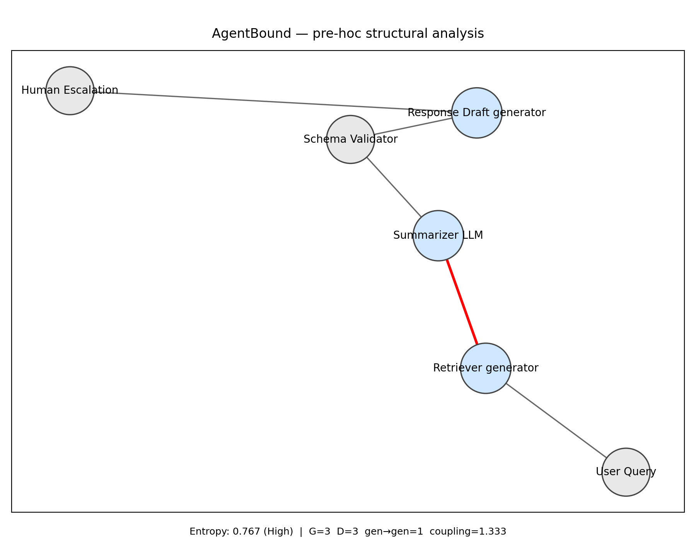
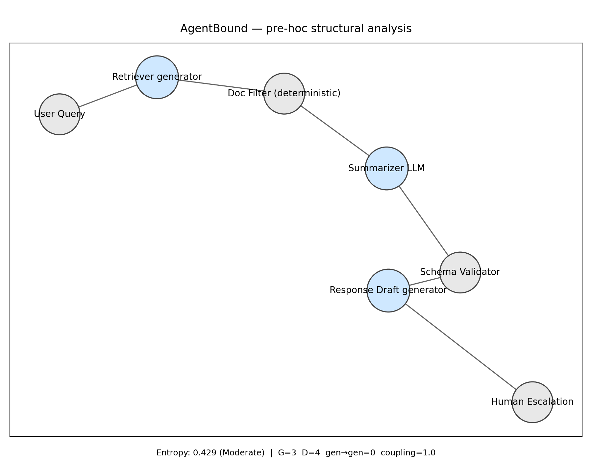
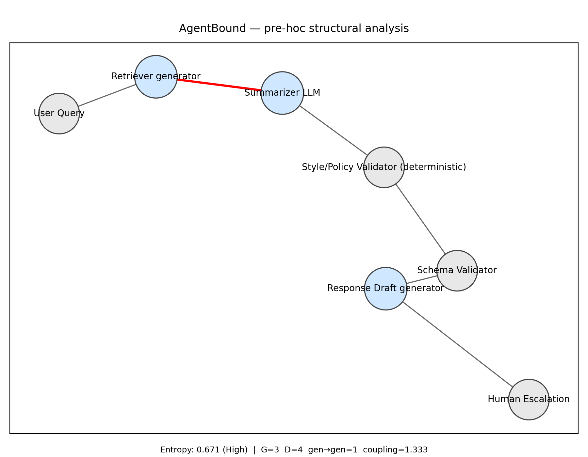

# Customer Support Workflow

This example demonstrates how AgentBound analyzes and compares three variants of a simple customer support pipeline.  

The example shows how small design changes (adding deterministic filters or validators) affect agentic entropy.

* [Architecture variants used](#architecture-variants-used)
* [Expected output](#expected-output)
* [Run the demo ](#run-the-demo)
    + [1. Setup](#1-setup)
    + [2. Analyze each variant](#2-analyze-each-variant)
    + [3. View the outputs](#3-view-the-outputs)
    + [4. Interpret the results](#4-interpret-the-results)
    + [5. Takeaways](#5-takeaways)

## Architecture variants used

Each architecture is represented by a graph JSON and a kind map located in `/inputs/`.

* [Variant A — Baseline (risky design)](#variant-a--baseline-risky-design)
* [Variant B — Improved with Doc Filter](#variant-b--improved-with-doc-filter)
* [Variant C — Validator after Summarizer](#variant-c--validator-after-summarizer)

### Variant A — Baseline (risky design) 
Defined by `A_graph.json` and `A_kind_map.json`.  
This version chains three generative components in sequence: a Retriever, a Summarizer LLM, and a Response Draft generator. The Retriever passes results directly into the Summarizer, creating an LLM-to-LLM handoff. That red edge is structurally brittle because both nodes are generative, amplifying uncertainty with no deterministic anchor in between.

### Variant B — Improved with Doc Filter
Defined by `B_graph.json` and `B_kind_map.json`.  
Here, a deterministic Doc Filter node is inserted between the Retriever and the Summarizer. This breaks the direct LLM-to-LLM chain. The architecture still contains three generative nodes overall, but they are now separated by deterministic steps. The result is a more balanced pipeline with lower entropy.

### Variant C — Validator after Summarizer
Defined by `C_graph.json` and `C_kind_map.json`.  
Instead of placing a filter before the Summarizer, this design inserts a Style/Policy Validator immediately after the Summarizer. While it introduces determinism downstream, it does not eliminate the risky Retriever → Summarizer handoff. The architecture therefore remains relatively brittle compared to Variant B, though more controlled than the baseline.

## Expected output

* Individual reports and diagrams for each variant (`A`, `B`, `C`).
* JSON metrics including entropy score, number of nodes, and risky edges.
* PNG diagrams highlighting risky edges in red.

Outputs are written to `artifacts/`. Example outputs are already saved there for reference.

---
## Run the demo 

### 1. Setup

1a. Navigate to the example folder:
```bash
cd examples/customer_support_agent
```

1b. (Optional) Create and activate a virtual environment:

```bash
python -m venv .venv && source .venv/bin/activate
```

1c. Install core requirements:

```bash
pip install -r ../../requirements.txt
```

---

### 2. Analyze each variant

Run `agentbound.py` on each graph. The 4th argument (`out`) tells AgentBound where to put outputs.

> Reference outputs are located in `examples/customer_support_agent/artifacts`

#### Variant A 

```bash
python ../../agentbound.py inputs/A_graph.json "" inputs/A_kind_map.json out
```

Generates:

* `out/A_graph_report.json`
* `out/A_graph.png`

#### Variant B 

```bash
python ../../agentbound.py inputs/B_graph.json "" inputs/B_kind_map.json out
```

Generates:

* `out/B_graph_report.json`
* `out/B_graph.png`

#### Variant C 

```bash
python ../../agentbound.py inputs/C_graph.json "" inputs/C_kind_map.json out
```

Generates:

* `out/C_graph_report.json`
* `out/C_graph.png`

---

### 3. View the outputs

As specified by the 4th argument in each command run in [2. Analyze each variant](#2-analyze-each-variant), your outputs are created in `examples/customer_support_agent/out`.

> For comparison, reference outputs are located in `examples/customer_support_agent/artifacts`.

Variant A:


Variant B:


Variant C:


---

### 4. Interpret the results

* [Comparison at a glance](#comparison-at-a-glance)
* [Variant A (Baseline — risky)](#variant-a-baseline--risky)
* [Variant B (Improved with Doc Filter)](#variant-b-improved-with-doc-filter)
* [Variant C (Validator after Summarizer)](#variant-c-validator-after-summarizer)

#### Comparison at a glance

| Variant | Entropy | Level    | G | D | gen→gen |
|---------|---------|----------|---|---|---------|
| **A** (Baseline) | 0.767 | High     | 3 | 3 | **1** |
| **B** (Doc Filter) | 0.429 | Moderate | 3 | 4 | 0 |
| **C** (Validator) | 0.671 | High     | 3 | 4 | **1** |

**Takeaway:** Removing the risky `gen→gen` edge (B) yields the strongest drop in entropy. Adding validation elsewhere (C) helps somewhat but doesn’t resolve the core brittleness.


#### Variant A (Baseline — risky)

```json
{
  "entropy_score": 0.767,
  "entropy_level": "High",
  "generative_nodes": 3,
  "deterministic_nodes": 3,
  "gen_to_gen_edges": 1,
  "coupling_factor": 1.333
}
```

Interpretation: Retriever → Summarizer is a brittle LLM-to-LLM handoff. High entropy.

---

#### Variant B (Improved with Doc Filter)

```json
{
  "entropy_score": 0.429,
  "entropy_level": "Moderate",
  "generative_nodes": 3,
  "deterministic_nodes": 4,
  "gen_to_gen_edges": 0,
  "coupling_factor": 1.0
}
```

Interpretation: Doc Filter breaks the risky edge. Entropy drops into Moderate range.

---

#### Variant C (Validator after Summarizer)

```json
{
  "entropy_score": 0.671,
  "entropy_level": "High",
  "generative_nodes": 3,
  "deterministic_nodes": 4,
  "gen_to_gen_edges": 1,
  "coupling_factor": 1.333
}
```

Interpretation: Adding validation improves structure but keeps the brittle edge. Entropy remains High.

---

### 5. Takeaways

* **Red edges matter**: removing `gen→gen` links (Variant B) is the biggest win.
* Adding determinism elsewhere (Variant C) helps but doesn’t fix the root cause.
* AgentBound highlights these trade-offs before you implement the code for any of the architectures.
