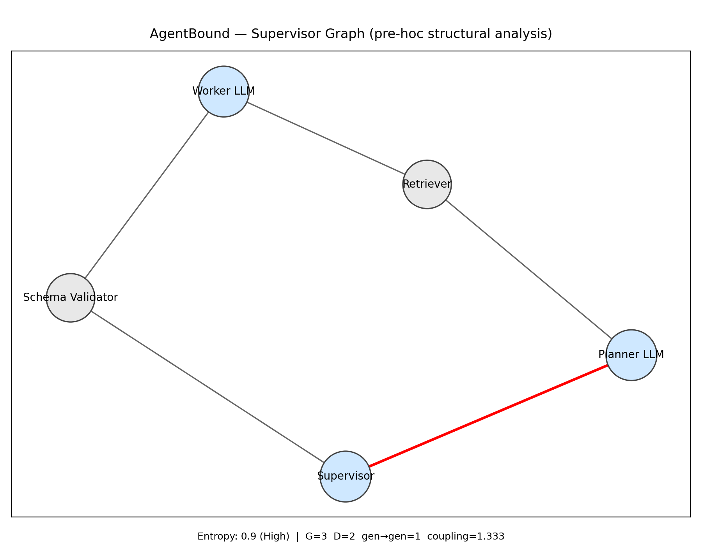

# Dummy LangGraph Supervisor

The following example demonstrates how AgentBound analyzes and compares two versions of the same multi-agent architecture (`langgraph_supervisor_demo.py` and `langgraph_supervisor_demo_variant.py`) based on [LangGraph’s Supervisor pattern](https://langchain-ai.github.io/langgraph/tutorials/multi_agent/agent_supervisor/). You’ll generate two pipeline graphs (`langgraph_supervisor.json` and `langgraph_supervisor_variant.json`), run design-time analysis on each using `agentbound.py`, and compare them side by side using `agentbound_compare.py`.

### Purpose of demo

This workflow shows how AgentBound can highlight structural differences between two designs (e.g. changes in complexity, potential stability risks, missing validation steps), all before the agentic system actually runs in production. It’s an example of how you can quickly assess the impact of architectural changes during the design phase.

### Expected output

* Individual reports and diagrams for each pipeline, showing metrics like agentic entropy, number of nodes, and risky patterns.
* A comparison diagram that visually contrasts the two architectures.
* JSON reports with detailed metrics you can integrate into your design review process.

---

## 1. Setup

1a. Navigate to the example folder:
```bash
cd examples/dummy_langgraph_supervisor
```

1b. Create and activate the virtual environment:
```bash
# Mac users: replace python with python3
python -m venv .venv && source .venv/bin/activate
```

1c. (Optional) Upgrade pip:
```bash
python -m pip install --upgrade pip
```

1d. Install core requirements:

```bash
pip install -r ../../requirements.txt
```

1e. Install example-specific requirements:
```bash
pip install -r requirements.txt
```

## 2. Generate pipeline graphs

2a. Export the baseline demo graph (`out/langgraph_supervisor.json`):

```bash
python langgraph_supervisor_demo.py
```

2b. Export the variant demo graph and kind map (`out/langgraph_supervisor_variant.json` and `out/kind_map_variant.json`):

```bash
python langgraph_supervisor_demo_variant.py
```

## 3. Analyze each graph

3a. Analyze the baseline graph. This will generate `out/langgraph_supervisor_report.json` and `out/langgraph_supervisor.png`"

```bash
python ../../agentbound.py out/langgraph_supervisor.json
```

3b. Analyze the variant graph. This will generate `out/langgraph_supervisor_variant_report.json` and `out/langgraph_supervisor_variant.png`:

```bash
python ../../agentbound.py out/langgraph_supervisor_variant.json
```

## 4. Compare A and B

Run the comparison script. This will generate `out/compare.png`, a side-by-side diagram of the two graphs.

```bash
python ../../agentbound_compare.py out/langgraph_supervisor.json out/langgraph_supervisor_variant.json
```

## 5. View the outputs

Outputs are located in `/out`. These outputs should match the examples located in `/artifacts`:

```bash
- compare.png
- kind_map_variant.json
- langgraph_supervisor_report.json
- langgraph_supervisor_variant_report.json
- langgraph_supervisor_variant.json
- langgraph_supervisor_variant.png
- langgraph_supervisor.json
- langgraph_supervisor.png
```

## 6. Understand the outputs

> For a detailed description of how to interpret the results, see [Interpret AgentBound output](../../README.md#interpret-agentbound-output).

> For an explanation of scoring methodology, see [How AgentBound scores a graph](../../README.md#how-agentbound-scores-a-graph).

### Baseline graph analysis 

Baseline graph: `langgraph_supervisor.json`

Report excerpt:

```json
{
  "graph_json": "out/langgraph_supervisor.json",
  "entropy_score": 2.067,
  "entropy_level": "Very High",
  "generative_nodes": 3,
  "deterministic_nodes": 0,
  "gen_to_gen_edges": 4,
  "coupling_factor": 1.667
}
```

Diagram: `langgraph_supervisor.png`

Interpretation: Three generative nodes, no deterministic anchors, multiple LLM to LLM edges, implies Very High risk.


### Variant graph analysis 

Variant graph: `langgraph_supervisor_variant.json`

Report excerpt:

```json
{
  "graph_json": "out/langgraph_supervisor_variant.json",
  "entropy_score": 0.400,
  "entropy_level": "Moderate",
  "generative_nodes": 2,
  "deterministic_nodes": 3,
  "gen_to_gen_edges": 0,
  "coupling_factor": 0.000
}
```

Diagram: `langgraph_supervisor_variant.png`

Interpretation: Deterministic anchors (retriever, schema validator, supervisor) reduce entropy. No direct LLM→LLM edges. Entropy score drops to Moderate.



### Comparison 

Diff excerpt:

```
{
  "entropy_delta": -1.667,
  "generative_delta": -1,
  "deterministic_delta": +3
}
```

Diagram: `compare.png`

Interpretation: By adding deterministic anchors and removing LLM handoffs, the variant design is structurally more stable and predictable.


