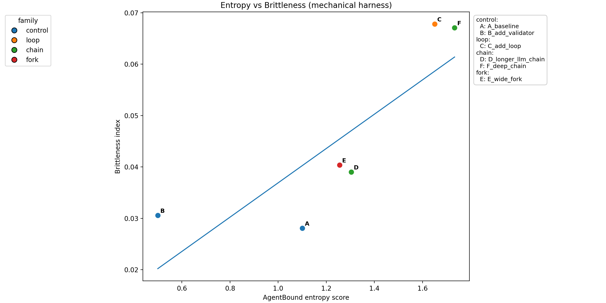
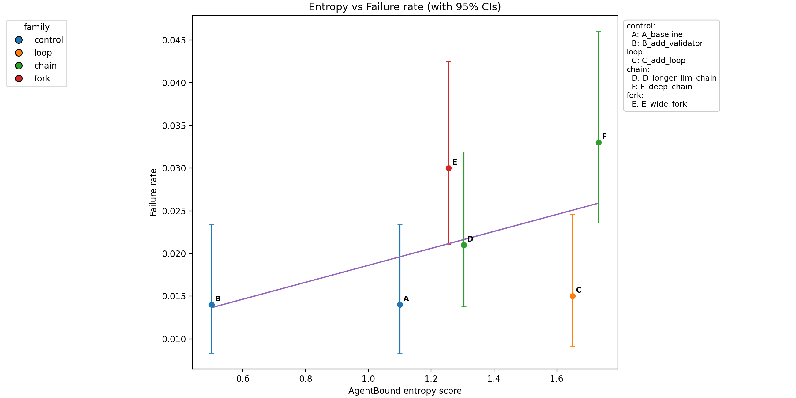

# Validation

This directory contains simulation and analysis artifacts for AgentBound.

## Workflow

1. **Run the harness**  
   Simulates multiple graph variants with retries/loops/etc. 

   ```bash
   ./run_harness.py --graphs graphs/ --results validation/results
   ```

2. **Merge with entropy metrics**
   Computes AgentBound entropy scores and risk levels, merges with harness brittleness metrics.

   ```bash
   ./compute_entropy.py --graphs graphs/ --results validation/results
   ```

3. **Plot**
   Generates visualizations of entropy vs failure rate with confidence intervals.

   ```bash
   ./plot_entropy_vs_failure.py --results validation/results/summary/all_results.json
   ```

## Outputs

* `results/` — raw simulation outputs (ignored by git).
* `results/summary/` — tracked JSON summaries and plots.

  * `ALL.summaries.json`: harness brittleness metrics
  * `all_results.json`: merged brittleness + entropy metrics
  * figures (`*.png`): entropy vs failure rate plots

## Notes

* `.gitignore` ensures raw run artifacts are ignored.
* Only summaries and plots are tracked for reproducibility.
* This pipeline = **simulate → compute → visualize**.

````markdown
# Validation

This directory contains simulation and analysis artifacts for AgentBound.

## Workflow

1. **Run the harness**  
   Simulates multiple graph variants with retries/loops/etc. 
    
   ```bash
   ./run_harness.py --graphs graphs/ --results validation/results
````

2. **Merge with entropy metrics**
   Computes AgentBound entropy scores and risk levels, merges with harness brittleness metrics.

   ```bash
   ./compute_entropy.py --graphs graphs/ --results validation/results
   ```

3. **Plot**
   Generates visualizations of entropy vs failure rate with confidence intervals.

   ```bash
   ./plot_entropy_vs_failure.py --results validation/results/summary/all_results.json
   ```

## Outputs

* `results/` — raw simulation outputs (ignored by git).
* `results/summary/` — tracked JSON summaries and plots.

  * `ALL.summaries.json`: harness brittleness metrics
  * `all_results.json`: merged brittleness + entropy metrics
  * figures (`*.png`): entropy vs failure rate plots

## Notes

* `.gitignore` ensures raw run artifacts are ignored.
* Only summaries and plots are tracked for reproducibility.
* This pipeline = **simulate → compute → visualize**.

## Results

### LangGraph supervisor variants

AgentBound’s entropy scores were validated against brittleness metrics in a lightweight simulation harness (`validation/graphs/langgraph_supervisor/`). Each variant graph was run for 1000 simulations, with failure rates and confidence intervals computed.

#### Variant explanations

All variants are located in `validation/graphs/langgraph_supervisor/`.

* `A_baseline` – minimal supervisor graph with two LLM calls and a deterministic end node.
* `B_add_validator` – adds a deterministic validator step, reducing direct LLM→LLM edges.
* `C_add_loop` – introduces a loop where the supervisor can re-ask the LLM; adds retries and self-dependence.
* `D_longer_llm_chain` – extends the chain depth with an additional generative hop.
* `E_wide_fork` – branches out into parallel LLM calls, increasing coupling across paths.
* `F_deep_chain` – pure LLM stack with no deterministic nodes, maximally brittle.

#### Brittleness Measurements

Brittleness is a composite index derived from:

* **Failure rate** – fraction of runs ending in unrecoverable error.
* **Retries** – how often loops and/or retries are triggered.
* **Path fragility** – long success paths vs short failure paths.
* **Loop/timeout rates** – frequency of bad cycles.
  The index is normalized to capture how easily a graph degrades under perturbations.

#### Findings

* **Entropy and brittleness correlate positively.** Higher entropy scores consistently align with higher brittleness indices and higher failure rates.
* **Control variants (A, B)**: Low entropy (0.5–1.1) and lowest brittleness.
* **Loop and deep chain variants (C, F)**: Highest entropy (1.65–1.73) and highest brittleness.
* **Wide fork (E)**: Moderately high entropy, and correspondingly higher brittleness.
* Error bars (Wilson 95% CI) confirm the trends are statistically meaningful.

#### Interpretation

* Entropy scores align with brittleness: **higher entropy = more fragile coordination**.
* Deterministic nodes (validators, rule-based checks) consistently lower entropy and brittleness.
* Graphs with more LLM to LLM coupling (loops, deep chains, wide forks) push entropy upward and show higher instability.
* This supports entropy as a **forward-looking risk signal**; entropy allows you can estimate brittleness without running the system thousands of times.

#### Caveats

* Results come from toy supervisor graphs; larger graphs may have nonlinear effects.
* The current test harness only simulates retries/loops/timeouts; other real-world brittleness (e.g. API rate limits, external service drift) isn’t modeled yet.
* Entropy thresholds labels like “Very High” are heuristic for now, not industry-standard cutoffs.
* Small differences at low failure rates (A vs B) may not be practically significant.

#### Plots

*Entropy vs Brittleness Index*


*Entropy vs Failure Rate (95% CI)*


#### Data

```json
[
  {
    "graph": "A_baseline",
    "path": "validation/graphs/langgraph_supervisor/A_baseline.json",
    "runs": 1000,
    "failure_rate": 0.014,
    "avg_retries": 0.197,
    "loop_rate": 0.0,
    "timeout_rate": 0.0,
    "mean_path_len_success": 2.0,
    "mean_path_len_failure": 1.928571,
    "handoff_error_rate": 0.0,
    "brittleness_index": 0.0281,
    "failure_rate_ci95": [0.008357, 0.023362],
    "loop_rate_ci95": [0.0, 0.003827],
    "timeout_rate_ci95": [0.0, 0.003827],
    "ci_method": "wilson",
    "generative_nodes": 2,
    "deterministic_nodes": 1,
    "gen_to_gen_edges": 1,
    "coupling_factor": 1.5,
    "entropy_score": 1.1,
    "entropy_level": "Very High"
  },
  {
    "graph": "B_add_validator",
    "path": "validation/graphs/langgraph_supervisor/B_add_validator.json",
    "runs": 1000,
    "failure_rate": 0.014,
    "avg_retries": 0.222,
    "loop_rate": 0.0,
    "timeout_rate": 0.0,
    "mean_path_len_success": 2.501014,
    "mean_path_len_failure": 2.357143,
    "handoff_error_rate": 0.0,
    "brittleness_index": 0.0306,
    "failure_rate_ci95": [0.008357, 0.023362],
    "loop_rate_ci95": [0.0, 0.003827],
    "timeout_rate_ci95": [0.0, 0.003827],
    "ci_method": "wilson",
    "generative_nodes": 2,
    "deterministic_nodes": 2,
    "gen_to_gen_edges": 0,
    "coupling_factor": 1.0,
    "entropy_score": 0.5,
    "entropy_level": "Moderate"
  },
  {
    "graph": "C_add_loop",
    "path": "validation/graphs/langgraph_supervisor/C_add_loop.json",
    "runs": 1000,
    "failure_rate": 0.015,
    "avg_retries": 0.282,
    "loop_rate": 0.153,
    "timeout_rate": 0.0,
    "mean_path_len_success": 2.57665,
    "mean_path_len_failure": 2.533333,
    "handoff_error_rate": 0.0,
    "brittleness_index": 0.0678,
    "failure_rate_ci95": [0.009111, 0.024601],
    "loop_rate_ci95": [0.132019, 0.176637],
    "timeout_rate_ci95": [0.0, 0.003827],
    "ci_method": "wilson",
    "generative_nodes": 3,
    "deterministic_nodes": 1,
    "gen_to_gen_edges": 4,
    "coupling_factor": 1.666667,
    "entropy_score": 1.65,
    "entropy_level": "Very High"
  },
  {
    "graph": "D_longer_llm_chain",
    "path": "validation/graphs/langgraph_supervisor/D_longer_llm_chain.json",
    "runs": 1000,
    "failure_rate": 0.021,
    "avg_retries": 0.264,
    "loop_rate": 0.0,
    "timeout_rate": 0.0,
    "mean_path_len_success": 2.497446,
    "mean_path_len_failure": 2.285714,
    "handoff_error_rate": 0.0,
    "brittleness_index": 0.039,
    "failure_rate_ci95": [0.013776, 0.031891],
    "loop_rate_ci95": [0.0, 0.003827],
    "timeout_rate_ci95": [0.0, 0.003827],
    "ci_method": "wilson",
    "generative_nodes": 3,
    "deterministic_nodes": 1,
    "gen_to_gen_edges": 2,
    "coupling_factor": 1.471405,
    "entropy_score": 1.303553,
    "entropy_level": "Very High"
  },
  {
    "graph": "E_wide_fork",
    "path": "validation/graphs/langgraph_supervisor/E_wide_fork.json",
    "runs": 1000,
    "failure_rate": 0.03,
    "avg_retries": 0.224,
    "loop_rate": 0.0,
    "timeout_rate": 0.0,
    "mean_path_len_success": 2.728866,
    "mean_path_len_failure": 2.533333,
    "handoff_error_rate": 0.0,
    "brittleness_index": 0.0404,
    "failure_rate_ci95": [0.021094, 0.042504],
    "loop_rate_ci95": [0.0, 0.003827],
    "timeout_rate_ci95": [0.0, 0.003827],
    "ci_method": "wilson",
    "generative_nodes": 4,
    "deterministic_nodes": 2,
    "gen_to_gen_edges": 3,
    "coupling_factor": 1.433013,
    "entropy_score": 1.255342,
    "entropy_level": "Very High"
  },
  {
    "graph": "F_deep_chain",
    "path": "validation/graphs/langgraph_supervisor/F_deep_chain.json",
    "runs": 1000,
    "failure_rate": 0.033,
    "avg_retries": 0.473,
    "loop_rate": 0.0,
    "timeout_rate": 0.0,
    "mean_path_len_success": 4.0,
    "mean_path_len_failure": 2.848485,
    "handoff_error_rate": 0.0,
    "brittleness_index": 0.0671,
    "failure_rate_ci95": [0.023593, 0.045982],
    "loop_rate_ci95": [0.0, 0.003827],
    "timeout_rate_ci95": [0.0, 0.003827],
    "ci_method": "wilson",
    "generative_nodes": 4,
    "deterministic_nodes": 0,
    "gen_to_gen_edges": 3,
    "coupling_factor": 1.433013,
    "entropy_score": 1.733013,
    "entropy_level": "Very High"
  }
]
```

#### Commands used

Run the following commands to reproduce the results:

```bash
# Run harness for all graphs
./validation/run_harness.py --graphs validation/graphs/langgraph_supervisor --runs 1000

# Merge with entropy metrics
./validation/compute_entropy.py --graphs validation/graphs/langgraph_supervisor

# Plot brittleness vs entropy
./validation/plot_entropy_vs_brittleness.py --y=brittleness_index
./validation/plot_entropy_vs_brittleness.py --y=failure_rate --with-ci
```
